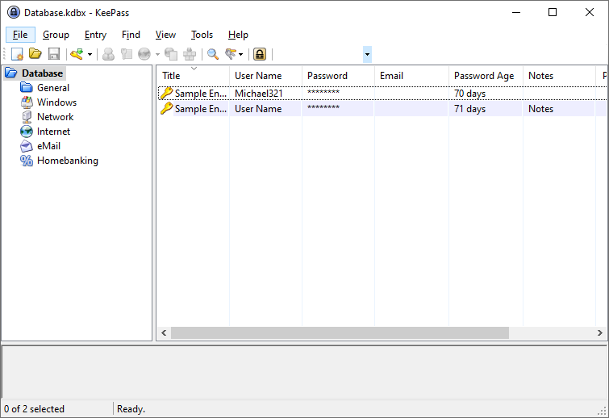

# PasswordAgeColumn

PasswordAgeColumn is a plugin for [KeePass](http://keepass.info). It provides you a column, which displays the age of the entries password.

 

## Installation

- Download the [latest](https://github.com/tiuub/PasswordAgeColumn/releases/latest) release;
- Copy the PasswordAgeColumn.plgx in the KeePass plugins directory and restart the application.

## Usage

You have to activate the "Password Age"-column first. 

For this, you have to go to:
- View -> Configure Columns -> (Scroll down) -> Check "Password Age"

## Example

The age in days of your passwords, will be counted since the day you set it and will be displayed in the "Password Age"-Column. It also counts through your entries history, to the date when it was changed last.

## License

